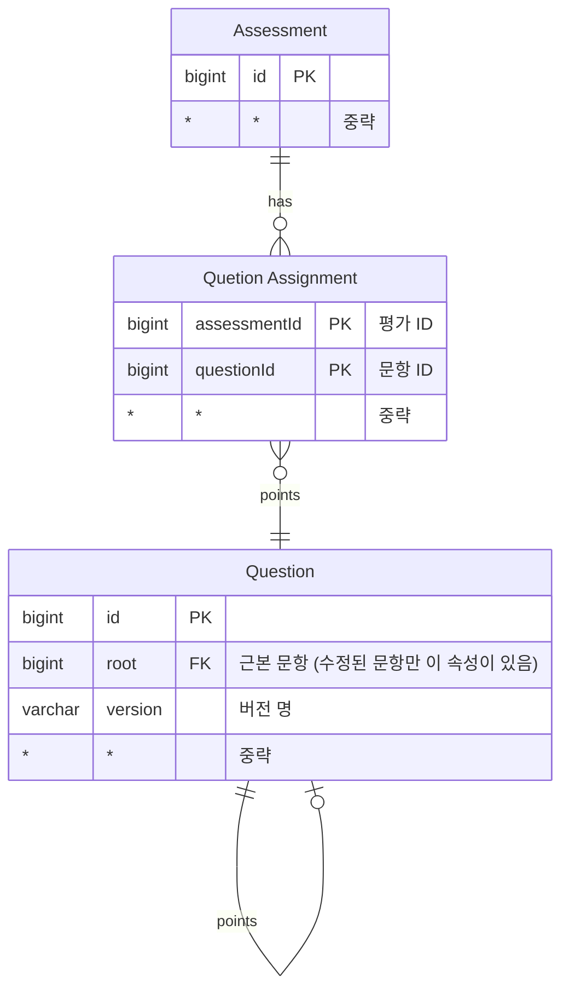
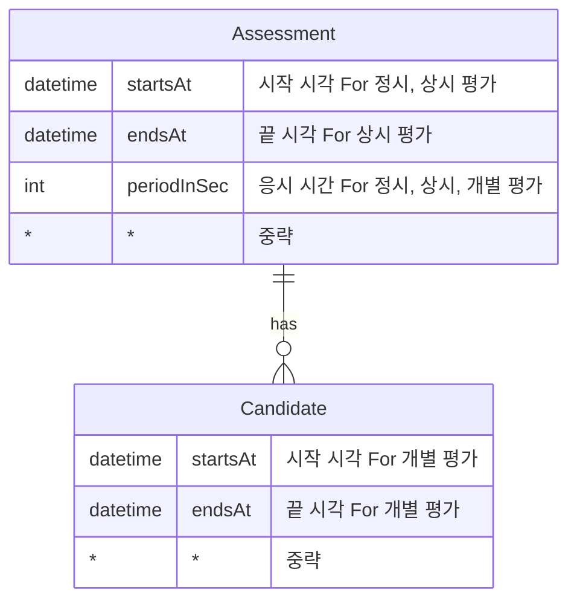

## 평가 기능 정하기

- 채점 결과 공개
- 응시자 안내 문구
- 응시 시간 설정
- 문항 배정
- 안내 메일 (템플릿) 작성
- 응시자 등록/수정/삭제
- 중복 사용 문제 체크
- 안내 메일 전송/전송 내역 조회
- 응시자 엑셀 업로드
- 본인인증 여부

## 문항 수정 정책

- 문항을 수정하더라도 기본적으로는 그 문항이 이미 배정된 평가에 영향이 없도록 한다.
- 다만 편의를 위해 문항 수정 직후 그 변경을 반영할 평가를 명시적으로 고를 수 있도록 한다.
- 이미 종료된 평가에는 영향을 주지 않는다.

## 응시 시간의 표현

평가 유형에 따라 응시 시간을 DB 에 저장하는 방법이 다르다.

